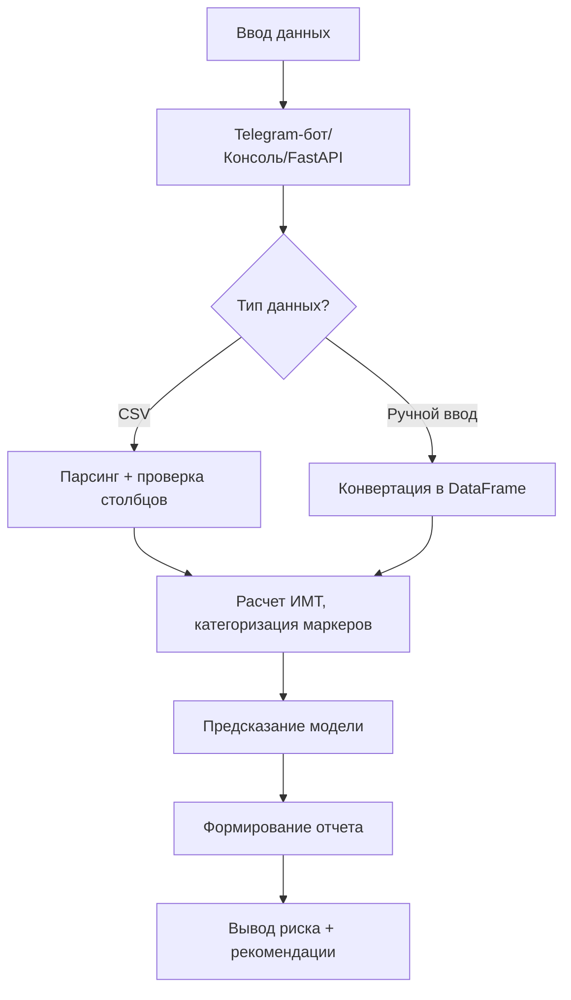
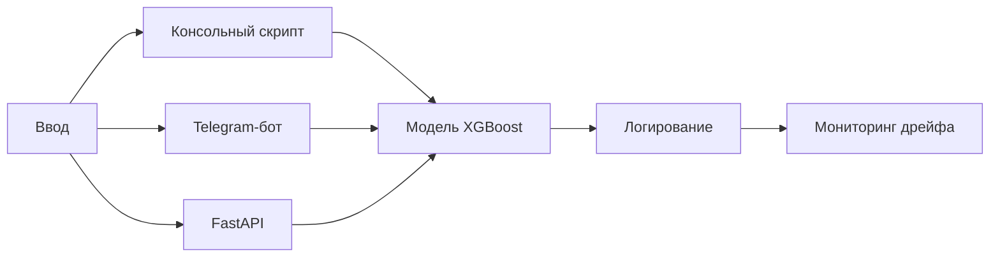

# ML System Design Doc - [RU]

## Дизайн ML системы - IHT Predictor Script v1.0.0

Предиктор ишемической болезни сердца по минимальному набору биохимических маркеров

### 1. Цели и предпосылки

#### 1.1. Зачем идем в разработку продукта?

- Бизнес-цель:
  - Создать инструмент для раннего выявления пациентов с высоким риском ИБС с помощью минимального набора биохимических маркеров.
- Профит от использования ML:
  - Автоматизация оценки риска для врачей первичного звена.
  - Снижение нагрузки на кардиологов за счет фильтрации низкорисковых пациентов.
- Критерии успеха:
  - Технические:
    - AUC-ROC > 0.85 (означает, что в 85% случаев модель ранжирует случайного пациента с ИБС выше, чем случайного здорового)
    - Recall > 0.8 (минимизация false negative).
  - Бизнес-метрики:
    - Внедрение в 1-2 тестовых клиниках (пилот).
    - Сокращение времени на анализ крови на 50%.

#### 1.2. Бизнес-требования и ограничения

- Бизнес-требования:
  - Минимальная себестоимость (использование open-source стека).
  - Возможность работы через telegram-bot и FastAPI.
- Бизнес-ограничения:
  - Не проводится регуляторный анализ.
- Ожидания от конкретной итерации:
  - Пользователь может подать данные в telegram-bot в описанном формате, получить на выходе лекго-интерпретируемый результат.
- Описание бизнес-процесса пилота:
  - Пользователь готовит данные в описанном формате по одному или нескольким пациентам.
  - Подаёт данные в telegram-bot.
  - Получает легко-интерпретируемый результат по каждому пациенту.
- Способы оценки пилота:
  - Успешный пилот = Система используется врачами в 1-2 клиниках 3+ месяца с показателями:
    - Технические: AUC-ROC не упал на новых данных > 0.02.
    - Бизнес: Врачи сократили время на анализ крови на 30%.
  - Методы оценки:
    - Анкетирование врачей (удобство интерфейса).
    - A/B-тест: сравнение скорости диагностики с/без системы.

#### 1.3. Что входит в скоуп проекта/итерации, что не входит

- В данной итерации выполняется только анализ минимального набора биохимических маркеров крови, возраст, пол и вес пациента:
  - Липидный профиль (оценивает риск атеросклероза — основной причины ИБС):
    - ЛПНП («плохой холестерин») > 3.0 ммоль/л — повышает риск образования бляшек.
    - ЛПВП («хороший холестерин») < 1.0 ммоль/л у мужчин и < 1.2 ммоль/л у женщин — снижает защиту сосудов.
    - Триглицериды > 1.7 ммоль/л — связаны с метаболическими нарушениями.
    - Липопротеин(а) [Lp(a)] > 30 мг/дл — независимый фактор риска тромбозов.
  - Маркеры воспаления (указывают на атеросклеротическое воспаление):
    - С-реактивный белок (СРБ) > 3 мг/л — высокий риск ИБС.
    - Миелопероксидаза (МРО) > 400 мкм — маркер нестабильности бляшек.
  - Кардиоспецифичные белки (обнаруживаются при повреждении миокарда):
    - Тропонины (I/T) — золотой стандарт диагностики инфаркта. Повышение через 2–6 часов после ишемии, пик — через 12–24 часа.
  - Дополнительные маркеры:
    - NT-proBNP > 125 пг/мл — указывает на сердечную недостаточность как осложнение ИБС.
    - Фибриноген > 300 мг/дл — связан с риском тромбозов.
    - Глюкоза и HbA1c — диабет увеличивает риск ИБС в 2–4 раза.
- Не анализируются другие виды скриннинга, таких как ЭКГ, УЗИ и прочее.
- Решение должно легко развёртываться, быть расширяемым.

#### 1.4. Предпосылки решения  

- В России самая высокая смертность от ишемической болезни сердца (20.8% всех смертей). Предоставление инструмента автоматизации анализа риска ИБС снизит риск ошибки врача и повысит его эффективность.
- Гранулярность модели:
  - Диагностический уровень:
    - Вероятность болезни
    - Стадии заболевания
    - Рекомендации
  - Детализация данных:
    - Средняя (анализ биохимических маркеров, возраст, пол, вес)
  - Частота прогнозирования:
    - Разовое (оценка при загрузке данных)

### 2. Методология

#### 2.1. Постановка задачи

Требуется выполнить бинарную классификацию и вернуть на выходе вероятность принадлежности к классу (риск ИБС).

**Выбор модели:**

- Алгоритм: Gradient Boosting (XGBoost/LightGBM)
- Причины:
  - Лучше обрабатывает смешанные типы признаков (бинарные + непрерывные)
  - Автоматически учитывает взаимодействия (например, ЛПНП × СРБ).
  - Поддержка ранней остановки для избежания переобучения.

> **Описание алгоритма:**
>
> - Обучение:
>   - Последовательно строит деревья, где каждое новое дерево исправляет ошибки предыдущего.
>   - Оптимизирует бинарную логистическую функцию потерь (для классификации).
> - Прогноз:
>   - Возвращает вероятность принадлежности к классу 1 (риск ИБС) — например, 0.78 (78%).
>   - Пороговая обработка (обычно 0.5).

#### 2.2. Блок-схема решения

> **Пример ответа:**
>
> - Риск ИБС: 68% (критический).  
> - Основные факторы:  
>   1. Тропонин I: 0.15 нг/мл (+25%)  
>   2. ЛПНП: 4.2 ммоль/л (+18%)  
>   3. Lp(a): 50 мг/дл (+12%)  
> - Рекомендации:  
>   - Срочная консультация кардиолога.  
>   - Контроль ЛПНП (цель < 1.8 ммоль/л).

#### 2.3. Этапы решения задачи

##### 2.3.1. Этап 1. Подготовка данных

Для обучения модели будем использовать 3 типа данных:

| Тип данных | Источники | Преимущества | Недостатки
| ------------- | ------------- | ------------- | -------------
| Клинические исследования | [Framingham Heart Study](https://biolincc.nhlbi.nih.gov/studies/framcohort), [NHANES](https://wwwn.cdc.gov/nchs/nhanes) | Стандартизированные данные, включают ключевые маркеры | Ограниченный набор новых биомаркеров (нет MPO, Lp(a))
| Госпитальные данные | [MIMIC-IV](https://mimic-iv.mit.edu) | Реальные данные пациентов, есть тропонины | Требует сложной предобработки
| Синтетические данные | Генерация через sdv.tabular.CTGAN на основе реальных распределений | Быстрое прототипирование | Риск артефактов

**Стратегия:**

- Базовый набор: Framingham + NHANES (липиды, возраст, пол, глюкоза).
- Расширенный набор: MIMIC-IV (тропонины, NT-proBNP) + синтетические Lp(a)/MPO.

**Целевая переменная (Target):**

- Наличие или риск ишемической болезни сердца (ИБС).
- Формат — Бинарная классификация:
  - 1 — высокий риск/наличие ИБС (например, по диагнозу или шкале SCORE ≥ 5%).
  - 0 — низкий риск/отсутствие ИБС.

**Признаки (Features) и их роль в модели:**

| Категория | Конкретные признаки | Медицинское обоснование | Тип данных
| ------------- | ------------- | ------------- | -------------
| Липидный профиль | ЛПНП, ЛПВП, Триглицериды, Lp(a) | Основные маркеры атеросклероза | Числовой
| Воспаление | СРБ, Миелопероксидаза (MPO) | Воспаление бляшек → риск разрыва | Числовой
| Кардиомаркеры | Тропонин I/T, NT-proBNP | Повреждение миокарда и сердечная недостаточность | Числовой
| Гликемия | Глюкоза, HbA1c | Связь диабета и ИБС | Числовой
| Гемостаз | Фибриноген | Риск тромбозов | Числовой
| Антропометрия | Возраст, Пол (♂=1, ♀=0), ИМТ | Немодифицируемые факторы риска | Числовой/Категориальный

**Подготовка и валидация данных:**

- Сбор и объединение
- Очистка (удаление пропусков, обработка выбросов)
- Feature Engineering
- Нормализация
- Валидация качества данных:
  - Полнота: > 80% заполнения для ключевых маркеров.
  - Баланс классов: Доля пациентов с ИБС ≥ 15% (если меньше — oversampling).
- Генерация синтетических данных для редких маркеров (Lp(a), MPO).
- Разделение данных (отделение признаков от целевой переменной)
- Документирование

**Проблемы и решения:**

| Проблема | Решение
| ------------- | -------------
| Нехватка тропонинов | Использовать MIMIC-IV + синтетические данные
| Разные единицы измерения | Конвертация в стандартные (ммоль/л, нг/мл)
| Смещение по полу/возрасту | Стратификация при разделении

**Результат этапа 1:**

- Есть ясность в том, что является целевой перменной, а что признаками, какие данные использовать и как их подготовить c учётом известных проблем.

##### 2.3.2. Этап 2. Подготовка прогнозных моделей

**Разделение выборок:**

- Разделяем данные на обучающую и тестовую выборки (стратифицированно, чтобы сохранить баланс классов).

**Обучение модели:**

- Обучаем модель на обучающей выборке.

**Валидация модели:**

- Оцениваем качество на тестовой выборке через:
  - AUC-ROC > 0.85 (означает, что в 85% случаев модель ранжирует случайного пациента с ИБС выше, чем случайного здорового)
  - Recall > 0.8 (минимизация false negative).

**Интерпретация модели:**

- Анализируем вклад признаков через SHAP-значения, пример:
  - Топ-3 самых важных признака:
    - Тропонин (чем выше, тем больше риск).
    - ЛПНП (порог > 3.0 ммоль/л).
    - Возраст (риск растет после 45 лет).

**Риски:**

- Смещение данных: Модель обучена на Framingham (белое население).
  - Mitigation: Добавить датасеты из Азии/Африки (например, NHANES мультиэтнические подвыборки).
- Дрейф данных: Референсные значения маркеров меняются со временем.
  - Mitigation: Переобучение раз в 6 месяцев.
- Нарушения GDPR:
  - Не применяется (данные обрабатываются локально, не передаются третьим лицам).

**Результат этапа 2:**

- Есть ясность в том, как разделить выборки, обучить, валидировать и интерпретировать модель, есть понимание рисков и как их митигировать.

##### 2.3.3. Этап 3. Подготовка инференса модели по итерациям

**Итерация 1. Базовый инференс (консольный скрипт)**

- Сохранение и загрузка модели:
  - Упаковка модели и препроцессинг для использования в продакшене.
- Минимальный рабочий инференс:
  - Принимает CSV или ручной ввод.
  - Возвращает вероятность риска ИБС.
- Проблемы:
  - Нет обработки ошибок (например, некорректные данные).
  - Медленно для массовых запросов.

**Итерация 2. Оптимизация инференса**

- Ускорение предсказаний:
  - ONNX-конвертация для XGBoost (ускоряет инференс в 2-3 раза).
  - Пакетная обработка (batch prediction).
- Добавление логирования:
  - Фиксация запросов и ошибок.

**Итерация 3. Продакшн-решение (Telegram-бот + API)**

- Telegram-бот:
  - Библиотека: python-telegram-bot (асинхронный).
- FastAPI-сервис:
  - Для интеграции с EHR (на будущее).

**Итерация 4. Мониторинг и тестирование**

- Нагрузочное тестирование:
  - Инструмент: Locust.
- Мониторинг дрейфа данных:
  - Библиотека: Evidently.
- Что улучшить:
  - Кэширование предсказаний (Redis).
  - Автоматический ретрайн модели при дрейфе данных.

**Результат этапа 3:**

- Есть ясность в том, как сохранить и загружать модель после обучения, оптимизировать модель и подготовить к продакшену, как выполнить мониторинг и тестирование, что можно улучшить.
  
### 3. Подготовка пилота
  
#### 3.1. Что считаем успешным пилотом  

- Критерии успеха:
  - Технические:
    - AUC-ROC > 0.85 (означает, что в 85% случаев модель ранжирует случайного пациента с ИБС выше, чем случайного здорового)
    - Recall > 0.8 (минимизация false negative).
  - Бизнес-метрики:
    - Внедрение в 1-2 тестовых клиниках (пилот).
    - Сокращение времени на анализ крови на 50%.

#### 3.2. Подготовка пилота  
  
- Обеспечивается наличие telegram-бота для старта пилота, так как с  приложением работают врачи.
- В бот не подаются персональные данные (GDPR не нарушен), только показатели.
- Обеспечивается SLA:
  - Задержка: 30 сек на предсказание.
  - Пропускная способность: до 1 запросов/мин (на 1 CPU).

#### 3.3. Издержки

**Расчетные издержки:**

| Ресурс | Стоимость (мес) | Обоснование
| ------------- | ------------- | -------------
| Хостинг бота (VPS) | $15 | 2 CPU, 2 GB RAM (для XGBoost)
| Хранение данных | $5 | S3, 50 ГБ логов
| Шифрование | $0 (Let’s Encrypt) | SSL для API
| Итого | $20

### 4. Внедрение

#### 4.1. Архитектура решения

#### 4.2. Описание инфраструктуры и масштабируемости

**Компоненты:**

- Сервис бота:
  - Выбор: Python + FastAPI (для будущего API) или чистый python-telegram-bot.
  - Почему не AWS Lambda? Бот требует долгоживущих подключений (Webhook).
- Хранение моделей:
  - Облако: S3-совместимое хранилище (например, Yandex Object Storage).
  - Локально: Git LFS (для MVP).
- Логирование:
  - Что логируем: Запросы, предсказания, ошибки.
  - Куда: CSV или SQLite (для анализа дрейфа данных).

**SLA и масштабируемость:**

- Задержка: < 10 сек (включая время предсказания).
- Пропускная способность: 10 RPS на 1 CPU (достаточно для пилота).
- Уязвимости:
  - Ограничение доступа по IP (если бот на Webhook).
  - Шифрование данных при хранении (GDPR).
  
#### 4.3. Требования к работе системы

**Цель:**

Предоставить врачам мобильный интерфейс для быстрой оценки риска ИБС.

**Функционал:**

- Команды:
  - /start — инструкция по использованию.
  - /predict — ручной ввод показателей.
  - /upload — загрузка CSV-файла.
- Поддержка данных:
  - Ручной ввод: ЛПНП=3.5, ЛПВП=1.2, Глюкоза=5.1 (формат ключ=значение).
  - CSV-файл: столбцы с названиями фичей (age, ldl, hdl и т.д.).
- Технологии:
  - Библиотека: python-telegram-bot (асинхронная, удобный API).
  - Хостинг: Бесплатный вариант — Render/Heroku; для продакшена — VPS.
  
#### 4.4. Безопасность системы  
  
- Угрозы:
  - SQL-инъекции: Использование ORM (например, SQLAlchemy).
  - DDoS: Ограничение запросов с одного IP (например, flask-limiter).
  
#### 4.5. Безопасность данных
  
- Данные пользователей:
  - Хранятся анонимизированно (без привязки к Telegram ID).
  - Автоматическое удаление через 30 дней.

#### 4.6. Издержки  
  
**Расчетные издержки:**

| Ресурс | Стоимость (мес) | Обоснование
| ------------- | ------------- | -------------
| Хостинг бота (VPS) | $150 | 20 CPU, 20 GB RAM (для XGBoost)
| Хранение данных | $50 | S3, 500 ГБ логов
| Шифрование | $0 (Let’s Encrypt) | SSL для API
| Итого | $200

#### 4.5. Integration points
  
- Telegram-бот вызывает модель в облаке, передавая показатели, модель выполняется расчёт и отправляет нотификацию обратно пользователю в чат с ботом.
  
#### 4.6. Риски и ограничения

- Модель не заменяет врача, только помощь в принятии решения.
- Риск смещения данных (например, Framingham — преимущественно белое население).
  - Mitigation: Добавление датасетов с разными этническими группами.

#### 4.7. Дорожная карта улучшений

- v1.1: Добавление тропонинов в модель (при наличии данных).
- v1.2: Дашборд для мониторинга метрик (Streamlit).
- v1.3: Распознавание показателей по скану или цифровому документу.
- v2.0: Интеграция с EHR через FHIR API.
